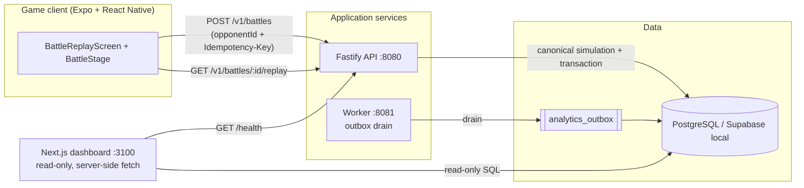

# Architecture overview

TypeScript-first monorepo for an asynchronous auto-battler. Server
authoritative; deterministic combat; replay-centric.

## Containers



## Battle sequence

```mermaid
sequenceDiagram
    actor P as Player
    C as Client (Expo)
    A as API
    E as combat-engine (pure)
    DB as PostgreSQL

    P->>C: select opponent, tap Fight
    C->>A: POST /v1/battles {opponentId} + Idempotency-Key
    A->>DB: BEGIN; idempotency lookup
    alt key seen
        A->>C: 200 original result (no side effects)
    else new key
        A->>DB: consume one fight allowance (SKIP LOCKED)
        A->>E: simulate(attackerSnapshot, defenderSnapshot, seed)
        E-->>A: events[] + outcome + checksum
        A->>DB: INSERT battles, participants, replays,<br/>progression_ledger(+1/+2 XP), analytics_outbox,<br/>battle_commands (unique guard)
        A->>DB: COMMIT
        A-->>C: 201 {battleId, outcome, xpAwarded}
        C->>A: GET /v1/battles/:id/replay
        A-->>C: canonical replay JSONB
        C->>P: render event stream via animation queue
    end
```

## Layering rules

- `packages/{rng,domain,replay,combat-engine}` are pure: no IO, no clocks,
  no `Math.random()`, no framework imports. Enforced by
  `scripts/check-boundaries.mjs` in CI.
- Only `apps/api/src/seeds.ts` touches a CSPRNG (`node:crypto`).
- The client renders replays; it never computes outcomes.
- The dashboard reads through its own server-side pool with a reporting
  credential; service-role keys never reach the browser.

## Data model (slice)

`accounts → characters (+ immutable build versions) → battles → participants`
plus `fight_allowances` (3/UTC day), `battle_replays`, append-only
`progression_ledger`, `analytics_outbox`, `admin_audit_log`. RLS is enabled on
all gameplay tables with deny-by-default policies; the API's server credential
bypasses RLS by design and is the only writer.
